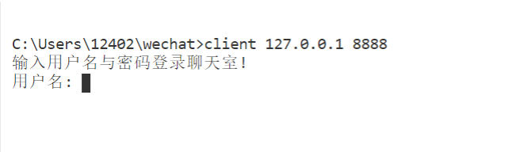
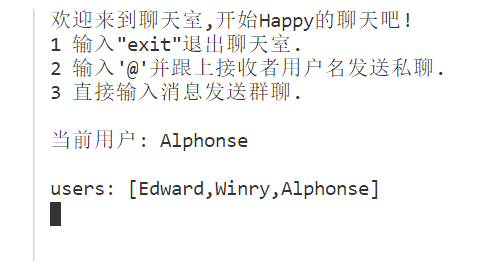
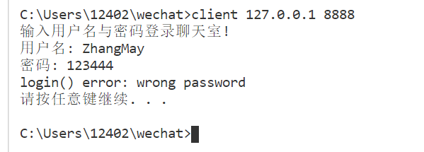
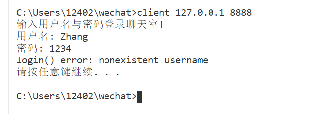
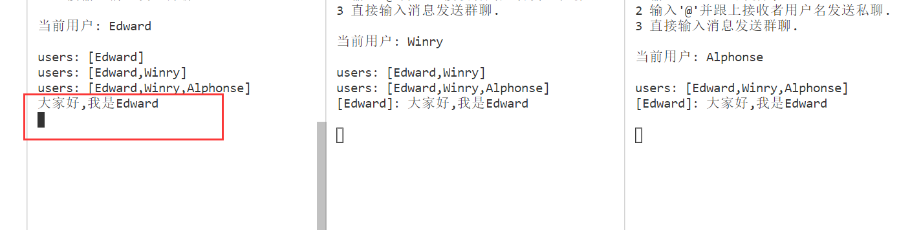
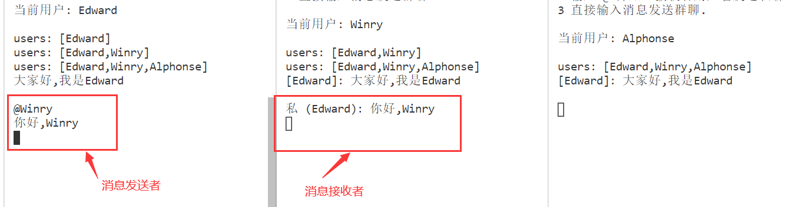
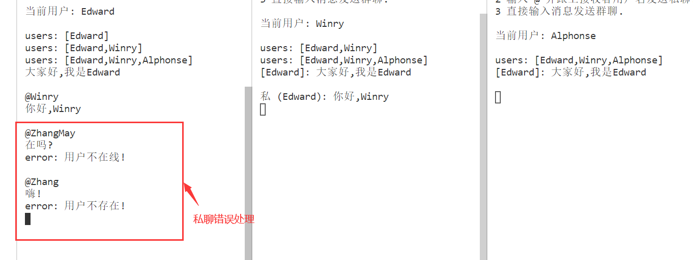
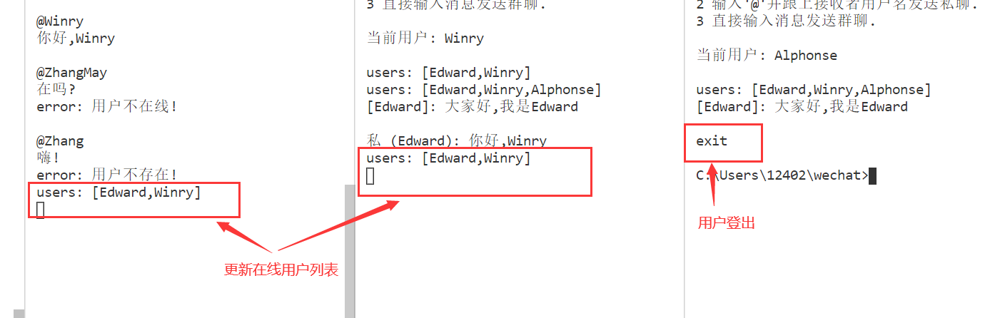

- [用户操作手册](#用户操作手册)
    - [更新LOG](#更新log)
    - [(一)、服务器端](#一服务器端)
    - [(二)、客户端：登录](#二客户端登录)
    - [(三)、客户端：群聊](#三客户端群聊)
    - [(四)、客户端：私聊](#四客户端私聊)
    - [(五)、客户端：登出](#五客户端登出)

# 用户操作手册

## 更新LOG

- 修复了用户由于用户名不存在或密码错误而登录失败时，也会给每一个在线用户发送在线用户列表的问题
- 增加了显示当前登录用户的用户名的功能

## (一)、服务器端

命令行输入：`server <服务器运行的端口号>`，如：

```shell
server 8888
```


## (二)、客户端：登录

1. 命令行输入`client <服务器IP地址> <服务器端口号>`运行客户端，如果服务器在本地，IP地址输入`127.0.0.1`，如：

```shell
client 127.0.0.1 8888
```



2. 输入用户名与密码可登录聊天室


3. 登录成功的提示信息（会显示当前用户与已登录的用户列表）



4. 登录失败的提示信息（用户名不存在或者密码错误）



---




## (三)、客户端：群聊

直接在聊天界面输入消息并发送即可，聊天信息会显示在除发送者以外的所有在线用户界面上：



## (四)、客户端：私聊

1. 先输入`@<消息接收者用户名>`，回车后，再输入私聊消息，如：

```shell
@Winry
你好,Winry
```

2. 消息发出后，将显示在消息接收者的屏幕上：



3. 如果私聊用户不存在或者私聊用户不在线将显示相应提示信息：



## (五)、客户端：登出

输入`exit`登出聊天室，登出成功后，将更新在线用户列表并显示在每个在线用户的屏幕上


