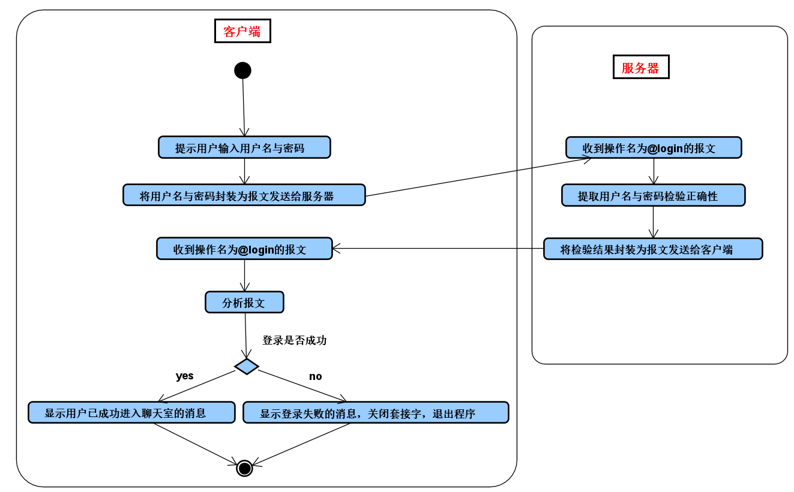
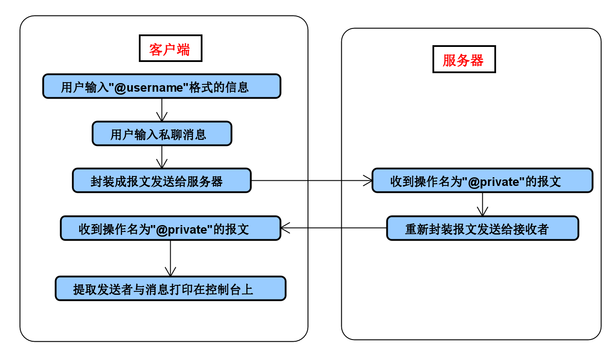
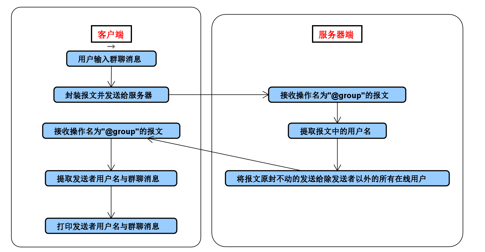
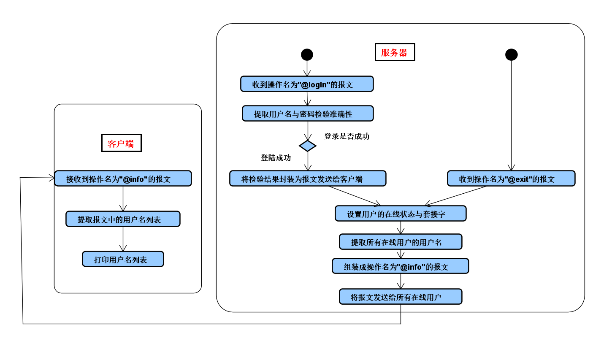
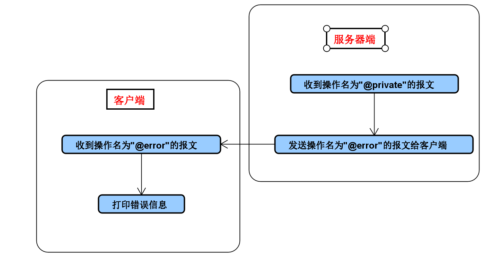
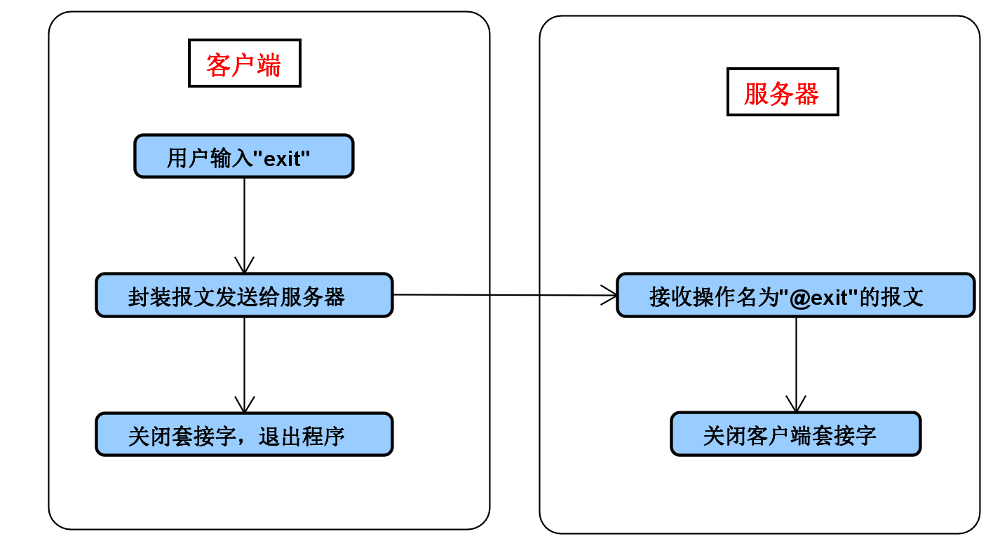

- [](#)
    - [(一)、登录](#一登录)
        - [1、客户端](#1客户端)
        - [2、服务器端](#2服务器端)
    - [(二)、私聊](#二私聊)
        - [1、客户端](#1客户端-1)
        - [2、服务器端](#2服务器端-1)
    - [(三)、群聊](#三群聊)
        - [1、客户端、服务器端](#1客户端服务器端)
    - [(四)、显示在线用户列表](#四显示在线用户列表)
    - [(五)、错误处理](#五错误处理)
    - [(六)、登出](#六登出)
        - [1、客户端](#1客户端-2)
        - [2、服务器端](#2服务器端-2)

# 设计思路

- 应用层协议设计及代码逻辑

约定：

- 用户名：5-10个字符，由大小写字母、数字组成
- 密码：5-10个字符，由大小写字母、数字组成
- 群聊/私聊消息：0-100个字符，不包含换行符
- 报文每行结尾都有一个换行符，用于分割每一行


## (一)、登录



### 1、客户端

| 行数 | 描述 | 字符数 |
| :-: | :-: | :-: |
| 第一行 | 指示当前操作是登录操作的字符串`@login` | 6 |
| 第二行 | 用户登录的用户名 | 5-10 |
| 第三行 | 用户登录的密码 | 5-10 |

例子：

```
@login
Edward
1234
```

### 2、服务器端

| 行数 | 描述 | 字符数 |
| :-: | :-: | :-: |
| 第一行 | 指示当前操作是登录操作的字符串`@login` | 6 |
| 第二行 | 描述登录结果的状态码 | 1 |

状态码：
- `1`：登录成功
- `0`：登录失败

如果状态码为`0`,则第三行为描述登录结果的短语,字符数为2-20之间
- `nonexistent username`：用户名不存在，登录失败
- `wrong password`：密码错误，登录失败

例子1：

```
@login
1
```

例子2：

```
@login
0
wrong password
```

## (二)、私聊



### 1、客户端

| 行数 | 描述 | 字符数 |
| :-: | :-: | :-: |
| 第一行 | 指示当前操作是私聊操作的字符串`@private` | 8 |
| 第二行 | 消息发送者的用户名 | 5-10 |
| 第三行 | 消息接收者的用户名 | 5-10 |
| 第四行 | 私聊消息 | 0-100 |

例子：

```
@private
Edward
Winry
Hello,Winry
```

### 2、服务器端

| 行数 | 描述 | 字符数 |
| :-: | :-: | :-: |
| 第一行 | 指示当前操作是私聊操作的字符串`@private` | 8 |
| 第二行 | 消息发送者的用户名 | 5-10 |
| 第三行 | 私聊消息 | 0-100 |

例子：

```
@private
Edward
Hello,Winry
```

## (三)、群聊



### 1、客户端、服务器端

| 行数 | 描述 | 字符数 |
| :-: | :-: | :-: |
| 第一行 | 指示当前操作是群聊操作的字符串`@group` | 6 |
| 第二行 | 用户登录的用户名 | 5-10 |
| 第三行 | 用户发送的群聊信息 | 0-100 |

例子：

```
@group
Edward
hello,world
```

## (四)、显示在线用户列表



| 行数 | 描述 | 字符数 |
| :-: | :-: | :-: |
| 第一行 | 指示当前操作是显示在线用户列表操作的字符串`@userinfo` | 9

紧接着第一行是用户名列表，每行都是一个在线用户的用户名

最后一行为字符串`#end`标志着用户名列表的末尾

例子：

```
@userinfo
Edward
Winry
Alphonse
#end
```

## (五)、错误处理



| 行数 | 描述 | 字符数 |
| :-: | :-: | :-: |
| 第一行 | 指示当前操作是错误处理操作的字符串`@error` | 6
| 第二行 | 错误码 | 1 | 

错误码：

- `1`：用户不存在
- `2`：用户不在线

例子：

```
@error
1
```

## (六)、登出



### 1、客户端

| 行数 | 描述 | 字符数 |
| :-: | :-: | :-: |
| 第一行 | 指示当前操作是登出操作的字符串`@exit` | 5 |
| 第二行 | 用户登录的用户名 | 5-10 |

例子：

```
@exit
Edward
```
